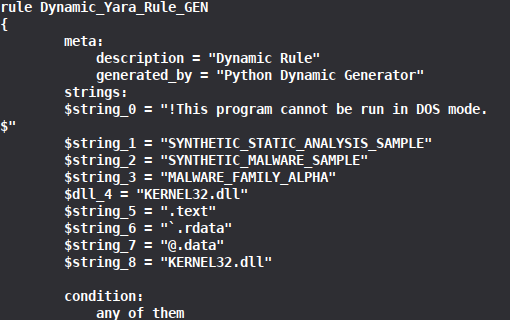

# Automated YARA Rule Generation using Discriminative PE Features

An automated YARA rule generation system that extracts features from Windows PE malware samples, compares their occurrence against goodware samples, calculates discriminative scores, and generates YARA rules automatically.

## Overview

Traditional YARA rules are commonly written manually by analysts based on known characteristics of malware.

This project explores an automated approach where PE features are statistically evaluated against both malware and goodware samples. Features that are frequent within the malware family but uncommon in goodware are assigned higher discriminative scores and selected for YARA rule generation.

The current implementation focuses primarily on:

- DLL names
- Strings

Additional PE feature types are currently extracted for experimentation, including:

- PE sections
- Import tables

## Pipeline

```text
Malware PE Samples
        |
        v
PE Feature Extraction
        |
        +-------------------+
        |                   |
        v                   v
  Malware Frequency    Goodware Frequency
        |                   |
        +---------+---------+
                  |
                  v
          Discriminative Score
                  |
                  v
            Feature Ranking
                  |
                  v
              Top-N Features
                  |
                  v
        Dynamic YARA Rule Generation
                  |
                  v
             .yar Rule File
## Screenshots

### Discriminative Feature Scoring

The system ranks extracted PE features according to their discriminative scores based on their occurrence in malware and goodware samples.


### Automatically Generated YARA Rule

The selected features are converted into a YARA rule automatically by the Python-based rule generator.


